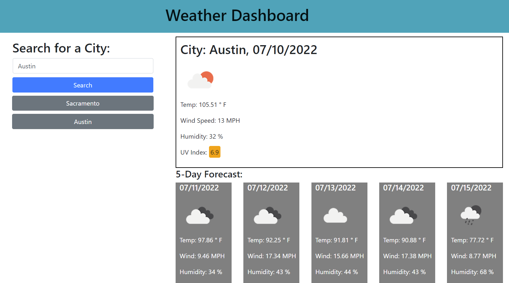

# Weather-Dashboard
Module 6 Challenge: Weather Dashboard by Sergey Holin

GitHub Repo Link: https://github.com/sergeyholin/Weather-Dashboard

GitHub Live Deployment Link: https://sergeyholin.github.io/Weather-Dashboard/

ABOUT THE APP:

Weather Dashboard is a simple application that allows a user to check current weather condition as well as 5 day forecast for that city.

ACCEPTANCE CRITERIA:

GIVEN a weather dashboard with form inputs
WHEN I search for a city
THEN I am presented with current and future conditions for that city and that city is added to the search history
WHEN I view current weather conditions for that city
THEN I am presented with the city name, the date, an icon representation of weather conditions, the temperature, the humidity, the wind speed, and the UV index
WHEN I view the UV index
THEN I am presented with a color that indicates whether the conditions are favorable, moderate, or severe
WHEN I view future weather conditions for that city
THEN I am presented with a 5-day forecast that displays the date, an icon representation of weather conditions, the temperature, the wind speed, and the humidity
WHEN I click on a city in the search history
THEN I am again presented with current and future conditions for that city

ADDITIONAL CRITERIA:

Application deployed at live URL.

SOURCES/CITATIONS: 

Some of my code (populate previosly searched cities with clickable buttons (lines:11-31) as well as UVI color coding (lines:80-92)) was inspired by a work of Mengmei Tu on a similar project, Link: https://github.com/mmeii/weather-dashboard

TECHNOLOGIES USED: 

Bootstrap (https://getbootstrap.com/)

jQuery (https://api.jquery.com/)

Moment (https://momentjs.com/)

OpenWeather's Geocoding API (https://openweathermap.org/api/geocoding-api)

OpenWeather's Current Weather Data API (https://openweathermap.org/current)

OpenWeather's One Call API 1.0 (https://openweathermap.org/api/one-call-api)

OpenWeather's 5 Day Weather Forecast API (https://openweathermap.org/forecast5)

SCREENSHOT:

